# FlyWheel News
FlyWheel news is a user-operated news site centred around cars. It is a place for dedicated car enthusiasts and experienced auto-journalists alike. The site is run through admin approval so users get only the best, highest quality articles to read.

The user themselves, once registered with an account on the site, can begin submitting posts for approval and then they will appear on the site. Users are also able to comment on posts, including posts that are not their own, to have a greater say in the conversation. Similarly, users can 'upvote' and 'downvote' each post to give their view in just one click. Finally, users are also given their own profile page, where they can easily return to posts they've made or commented on, to pick up where they left off, and also customise their profile to give them a better sense of identity using the site.

## Planning

To assess the needs of the user, and map out development goals, a number of different planning strategies have been implemented.

### Wireframes

In order to see the website through the user's eyes, it was important to give some thought as to how the site should look at a glance, with the most frequently used and visually demanding aspects of the site being the forefront of the design planning.

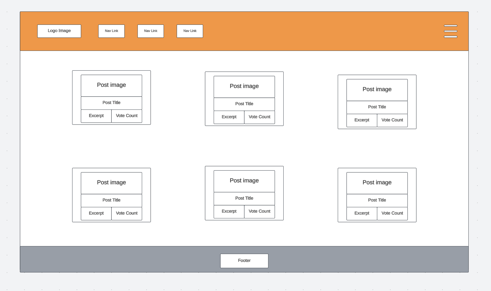

- This screenshot is of the home page / index page of the site, where users are shown the latest posts that are appearing on the site. To get around, there are nav bar links at the top of the page, which also becomes a burger-bar style drop down menu when viewed on smaller devices.
- To make the posts eye-catching and something the user wants to click on, all posts have a large image being displayed, with the title, below it in a large font, along with a short excerpt to interest the reader, and finally a display of the total number of upvotes/downvotes the post has, to show how other users feel about the post to guide their decision in whether the user thinks it is something they want to read or not.
- Finally, there is also a footer at the bottom of the page containing social media links, so users can interact with the FlyWheel company on other social media sites as well.

\
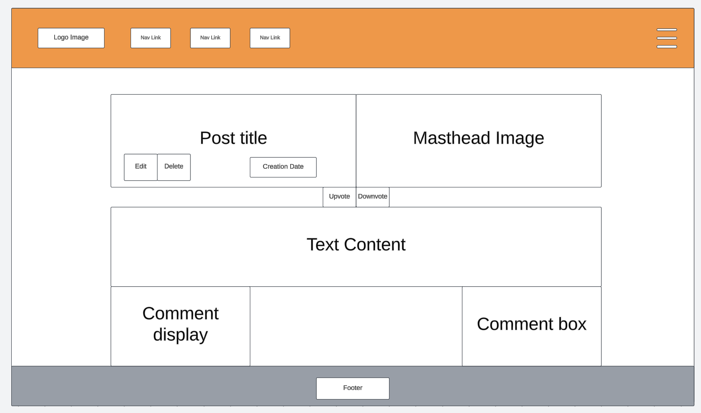
- In this wireframe, we have the template designed to be seen by users when they first open up a post on the site. Again, to keep readers invested, the title and image that appear in the masthead at the top of the image are made eye catching and visually appealing. Within this masthead, if the user is the creator of the post, this is where the buttons to either edit the post or delete the post appear. 

- Below the masthead is where users are able to place vote on posts, giving either an upvote or a downvote, with a total counter along with it so the user is provided some feedback on their choice as they can see the count go up and down. Below this, we have the total text content of the post, which, using django summernote, can be formatted to the creator's specifications, making their article more engaging through things such as making bold headings or colourful text.

- Finally, we have the comment section, where users can create a comment on the right, and provided the comment is approved by an administrator, their comment will appear on the left. 

\
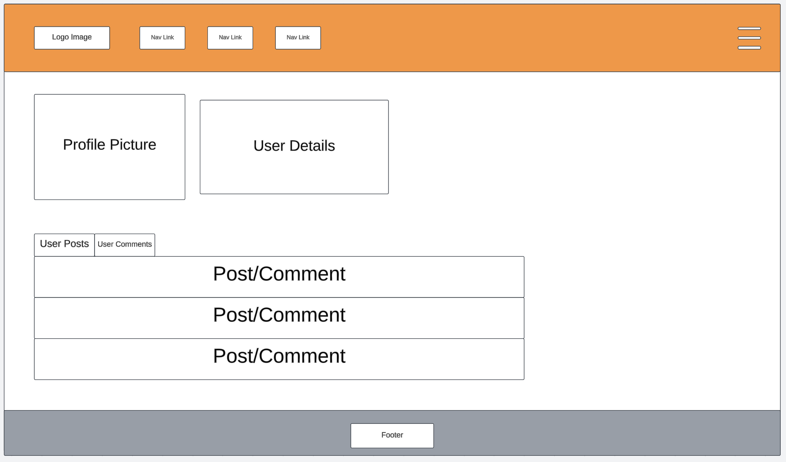

- This is a mockup of the user's profile page. It will be created for them when they make an account. Here, the user is able to tell others a bit about themselves and personalise their account, which will keep them engaged with the site as they are able to express themselves how they see fit, creating a welcoming environment.

- The user is able to upload a profile picture to represent them, along with some details about themselves, such as what their favourite car is, what car they drive now, and a tally of all the posts/comments they have made on the site, so they can see how active they are as a user.

- Beneath the user details, we have a two lists the user can flick between to see what they want, namely the posts they have made, or comments they have left. This easily allows the user to come back to or monitor their own interactions with the site, ensuring that it will not get drowned amongst everyone else's contributions to the site, allowing them to stay a part of the conversation.

## Models

In order to give greater meaning and functionality to the site, it was important to create Entity Relationship diagrams so that I can understand how the database will look, and where user interactions will end up.

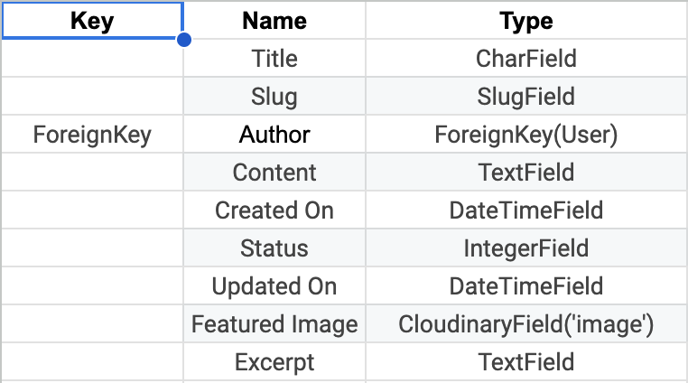
- This Post model ncludes fields like Title (a character field), Slug (used for URL generation), Author (a Foreign Key linked to a User model), and Content (text). Additionally, it tracks timestamps like Created On and Updated On using DateTimeField, and stores metadata such as Status (an integer) and Excerpt (a brief text summary). A CloudinaryField is used to manage an image for the post (Featured Image). These fields collectively structure the essential details for managing posts.

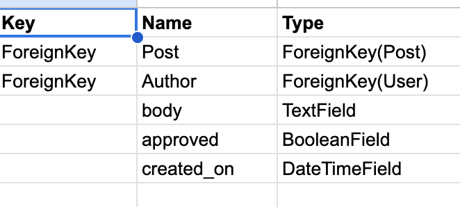
- This is the comment model, which is related to a specific blog post and author. The fields include Post and Author, both defined as ForeignKey fields linking to the Post and User models respectively. The main content of the comment is stored in the body field as text. Additionally, the approved field is a BooleanField indicating whether the comment has been approved for display, and created_on is a DateTimeField that stores the timestamp of when the comment was made. This model allows for tracking comments associated with posts and their approval status.
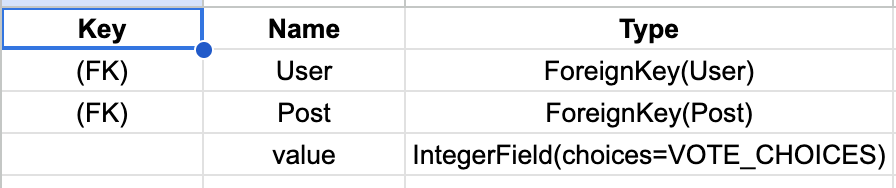
- This model represents a Voting system for posts, capturing user interactions through upvotes and downvotes. It includes User and Post fields, both defined as ForeignKey, linking to the User and Post models, respectively. The value field is an IntegerField that stores the actual vote, with predefined options (VOTE_CHOICES) representing upvote and downvote values (e.g., +1 for upvote, -1 for downvote). This model allows tracking which users have voted on specific posts and what type of vote they cast.

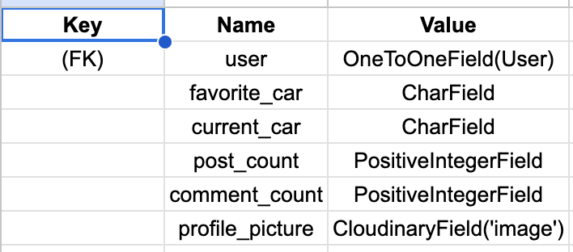
- This model is for user profiles with the following fields: a user field represented by a OneToOneField linking to the User model (as a foreign key), indicating that each profile is associated with a unique user. The profile also includes two CharField attributes, favorite_car and current_car, for storing the user's favorite and current cars as text. Additionally, it tracks user activity with post_count and comment_count, both implemented as PositiveIntegerField to count the number of posts and comments, respectively. Lastly, the profile_picture field uses a CloudinaryField, which handles image uploads and storage, using the Cloudinary service for storing user profile pictures.

## Features and Goals

In order to make sure my users can interact with the site in the intended way, I created and tracked User Stories using Gitpod Projects, by creating a project associated with the FlyWheel site, and planned out interactions and functionality the users would need in order to properly engage with the site. Using Gitpod Projects, I was able to create Issues and address them individually in order to create the best site possible. 

### Issues and responses
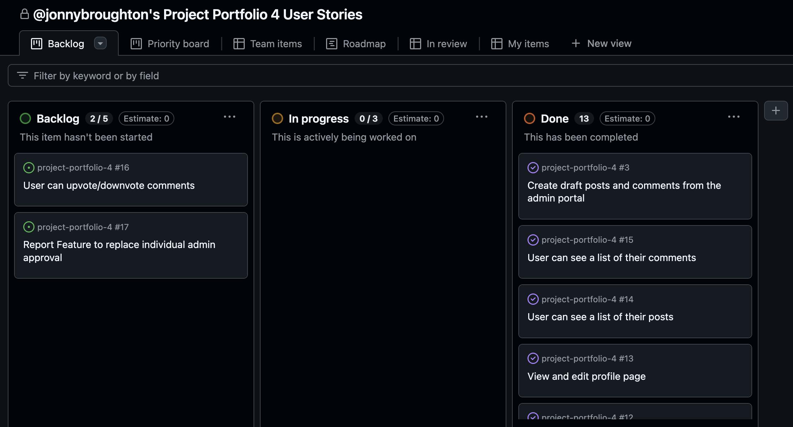

Here, we can see the kanban board with each of the development stages. They range from Backlog, for things not started yet, In progress, for things that are being worked on, and Done, for user stories that have been completed.

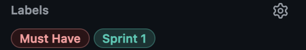

In order to keep the focus and have a clear production path in mind, in addition to using the kanban board to map out development, I made use of Gitpod Project's labels feature, so that I could give additional meaning to each issue. I seperated issues with two types of labels, whether the issue was something the site Must have, Should have, and Could have, and also Sprint labels in order to give a better structure as to what should be done first.

#### Tracking Issues

**As a Site User I can create an account so that I can interact with the site to a greater extent**

This issue is complete, as the user is able to create an account using Django AllAuth, and they can create posts/comments with this functionality.

**As a site user I can view a paginated list of posts so that I can select which post I want to view**

This issue is complete, as when there are more than 6 posts being displayed at one time, a button appears at the bottom of the page allowing the user to look at the next, or previous set of 6 posts.

**As a logged in site user I can create, read, update and delete comments so that I can start my own discussion or share my opinion within a post**

This issue has been completed, logged in users have full control of both their posts, and comments, and these can be edited or deleted at will. If the user is not logged in, they can only read things on the site, and furthermore, posts are protected in that they can only be edited or deleted by the owner.

**As a Site User I can open a post so that I can see the content within** and **As a Site User / Admin I can view comments so that view comments on an individual post so that I can read the conversation**

Both of these issues are complete, users can open posts to view the content inside, and comments are also displayed underneath the post content.

**As a Site Owner/Site User I can upload a custom image to a post so that I can visually demonstrate a topic of conversation or make a more eye catching post**

Users are able to add an image to their post, and it will appear both on the card for the post in the index/home page, and also be displayed when viewing the post details by clicking on the index card. If the user does not choose an image, a default placeholder will be used instead.

**As a logged-in Site User I can Upvote/Downvote Posts so that I can give my opinion on a post with just a click.**

Logged in users, once on the post detail page, are able to either upvote or downvote on a post. When they make a choice, there is a vote total above the buttons, and the user is able to see that their vote has been counted. The count can even go into the negatives, in the case that it's very unpopular. This count is also displayed under a post title on the index page so users can see how many votes a post has without having to view the post itself.

**As a Site User I can view and edit my account details on my profile page so that I can personalise my profile and gain a sense of identity on the site**

When a user creates an account, a profile page is set up for them, which they can access and edit with things such a profile picture, and also a bit of information about themselves like their favourite car or what car they currently have. This enables the user to feel as though they can express themselves in their own unique way. The profile also counts how many posts and comments they have made and left, so the user can be proud of their dedication to the site.

**As a Site User I can see a list of my posts I've created on the site so that I can easily go back to my post to see how it is performing and what comments have been left** and **As a Site User I can see a list of the comments I have left so that I can see if they have been approved by the site admin and go back to posts I've commented on**

Below the user's basic information such as their profile picture, personal details and stats, the user can also browse through their history of posts, and also a list of comments they have left. This allows them to instantly go back to content they have added to the site, to see things such as how their post is performing, or how a conversation is progressing in comment section they have contributed to.

#### Backlog issues
I have a couple of prospective features that could be added to the site eventually in order to give the site greater functionality:

**As a Site User I can leave a vote on a comment so that I can provide feedback to a person's comment and measure the popularity of the comment by seeing how many votes it has on it**

- This feature would be good to allow users to vote on other people's opinions on a post, for example, upvoting the comment if you agree or downvoting if you think they're incorrect.

**As a Site User I can report posts and comments so that I can create posts and comments that are published immediately without the need for admin approval, but I can flag offensive/inappropriate content to bring it to the admin's attention**

This feature would be a rather big change, and comes as a suggested alternative for how user interactions become approved on the site. With the website's current functionality, each time a user posts or comments, this is sent to the admin console for the admin to approve, which ensures quality posting and less abuse to be present on the site, however, if we opted for a Report feature instead, all posts and comments could appear on the site instantly, and users would have the option to report content they find unsavoury. This change would likely be necessary as the site increases in popularity to make it more dynamic to handle many users, ensuring that only content flagged up gets the admin's attention.

## Testing

In order to ensure quality code and minimise errors, I have done a range of testing to different aspects of the site.

### Manual Testing

<table>
<tr>
<th>Test Name</th>
<th>Steps</th>
<th>Expected Result</th>
<th>Outcome</th>
<th>Pass/Fail</th>
<tr>
<td></td>
<td></td>
<td></td>
<td></td>
<td></td>
</tr>
<tr>
<td>Logo Button</td>
<td>Click the Logo of the website in the top left hand of the screen</td>
<td>The user is returned to the index page</td>
<td>[Expected outcome achieved]</td>
<td>Pass</td>
</tr>
<tr>
<td>Home Button</td>
<td>Click the Home button in the Navbar</td>
<td>The user is returned to the index page</td>
<td>[Expected outcome achieved]</td>
<td>Pass</td>
</tr>
<tr>
<td>Registration Button</td>
<td>Click the Register button</td>
<td>The user is brought to the Register/Signup page</td>
<td>[Expected outcome achieved]</td>
<td>Pass</td>
</tr>
<tr>
<td>Login Button</td>
<td>Click on the Login button in the Navbar</td>
<td>The user is brought to the Login page</td>
<td>[Expected outcome achieved]</td>
<td>Pass</td>
</tr>
<tr>
<td>Login Button</td>
<td>Click on the Login button in the Navbar</td>
<td>The user is brought to the Login page</td>
<td>[Expected outcome achieved]</td>
<td>Pass</td>
</tr>
<tr>
<td>Sign In redirection button</td>
<td>On the registation, click on the orange text directing users who already have an acccount to log in instead</td>
<td>Users are redirected to the Log in page</td>
<td>[Expected outcome achieved]</td>
<td>Pass</td>
</tr>
<td>Sign Up Button</td>
<td>On the registration page, click the Sign Up button</td>
<td>When you have created credentials for your account, click the Sign Up button and be brought to the index page with a message that you have signed in</td>
<td>[Expected outcome achieved]</td>
<td>Pass</td>
</tr>
<tr>
<td>Sign in In Button</td>
<td>On the Log In page, click the Sign In button</td>
<td>When you have entered credentials for your account, click the Sign In button and be brought to the index page with a message that you have signed in</td>
<td>[Expected outcome achieved]</td>
<td>Pass</td>
</tr>
<tr>
<td>Post Title Button</td>
<td>Click on the title of the post you want to view</td>
<td>You are taken to the Post detail page</td>
<td>[Expected outcome achieved]</td>
<td>Pass</td>
</tr>
<tr>
<td>Submit Comment Button</td>
<td>Once you have filled out a comment, you can click submit to send it for approval</td>
<td>When the button is clicked, the comment is added to the list of comments, but greyed out with a message telling the user their comment is waiting to be submitted for approval by admins. Users are provided two more buttons to edit their comment or delete it</td>
<td>[Expected outcome achieved]</td>
<td>Pass</td>
</tr>
<tr>
<td>Upvote/Downvote Buttons</td>
<td>On the Post detail page, click on either upvote/downvote buttons</td>
<td>An upvote will add a number to the overall count of votes. Clicking the downvote button will take away a number from the overall count of votes</td>
<td>[Expected outcome achieved]</td>
<td>Pass</td>
</tr>
<tr>
<td>Edit Comment Button</td>
<td>Click edit to edit the comment you've made</td>
<td>The user's comment is sent back into the comment body field to edit their comment, and then resubmit it</td>
<td>[Expected outcome achieved]</td>
<td>Pass</td>
</tr>
<tr>
<td>Delete comment button</td>
<td>Click the delete button on your comment, and then delete on the confirmation warning to delete the comment</td>
<td>When the button is clicked, users are shown a message asking them to press the delete button once more within the message to ensure they are okay with their action</td>
<td>[Expected outcome achieved]</td>
<td>Pass</td>
</tr>
<tr>
<td>Create Post button</td>
<td>Click create post to fill out the post creation form</td>
<td>Users can click this button and then fill out the form for their post, and include an image from their computer to accompany their post if they so wish. When submitted, they are returned to the index page with a message informing them their post will appear when an admin approves it.</td>
<td>[Expected outcome achieved]</td>
<td>Pass</td>
</tr>
<tr>
<td>Edit Post button</td>
<td>If the user is the author of the post, they can click the edit post button to be brought back to the post creation form and make changes</td>
<td>The user is taken to the form where they can update the form for the post, without the need to resend the post to the admins</td>
<td>[Expected outcome achieved]</td>
<td>Pass</td>
</tr>
<tr>
<td>Delete post button</td>
<td>If the user is the author of the post, they are given the option to delete the post.</td>
<td>The user is asked one more time in a popup message if they're sure they want to delete it, and if so, the post is then deleted from the list of posts on the index page</td>
<td>[Expected outcome achieved]</td>
<td>Pass</td>
</tr>
<tr>
<td>My Profile Button</td>
<td>Click the My Profile button in the navbar once logged in    </td>
<td>The user is brought to their Profile page</td>
<td>[Expected outcome achieved]</td>
<td>Pass</td>
</tr>
<tr>
<td>Post/Comment history tabs</td>
<td>Users can see their previous posts and comments at the bottom of the profile page by clicking on each tab</td>
<td>The list of the latest posts and comments made by the user can be viewed by looking at either tab, and within these lists, they can see either the post detail page of posts they have made, or the post where they have left their comment</td>
<td>[Expected outcome achieved]</td>
<td>Pass</td>
</tr>
<tr>
<td>Edit Profile button</td>
<td>When on the the profile page, users can click the edit profile button to fill out a short form which will be displayed on their profile page</td>
<td>Users are able to fill out their profile form with their favourite car, current car, and a profile picture if they choose</td>
<td>[Expected outcome achieved]</td>
<td>Pass</td>
</tr>
</tr>
</table>

### Validator Testing

I used four seperate validators to check for issues accross each language used in the project.

#### Code Institue Python Linter

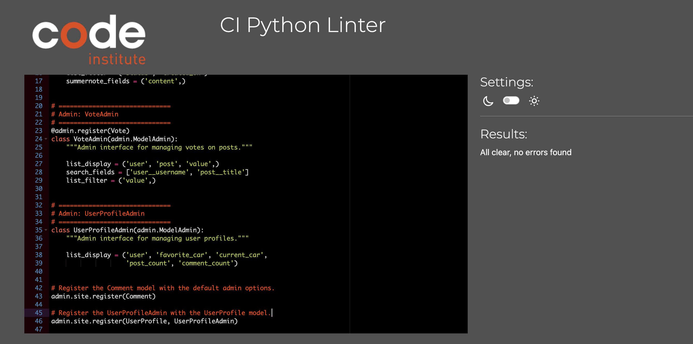
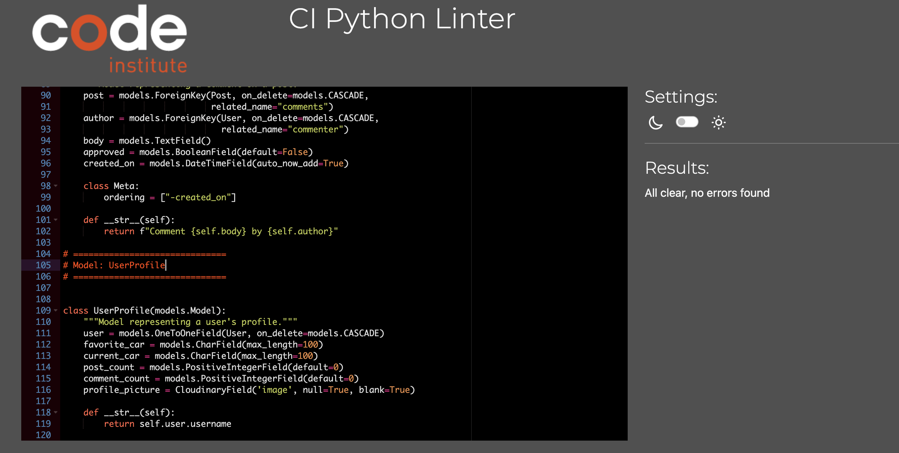
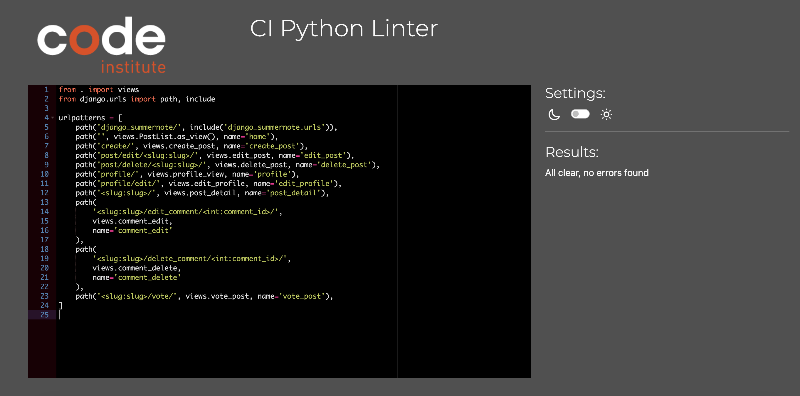
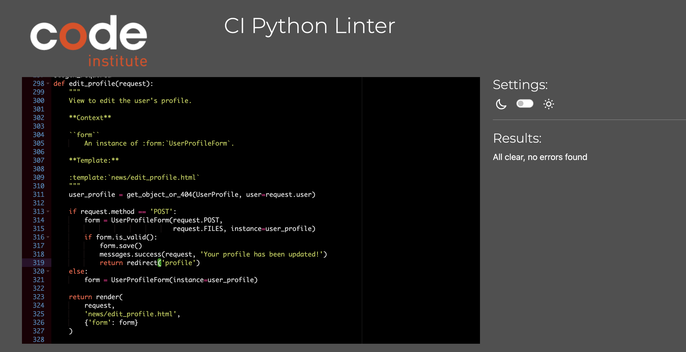

As you can see, any issues with the python for the app is inline with PEP8 standards. Some issues that arose when using the linter were basic things such as double spaces expected between classes, and lines being too long, but all of those issues have been smoothed over.

#### JSHint

Although there are only a couple of Javascript files in the project, I used JSHint to make sure they are compliant.
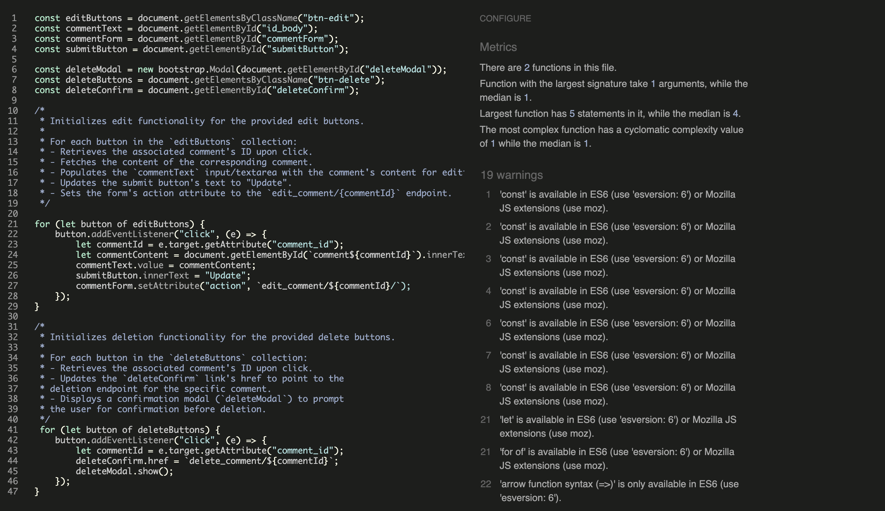
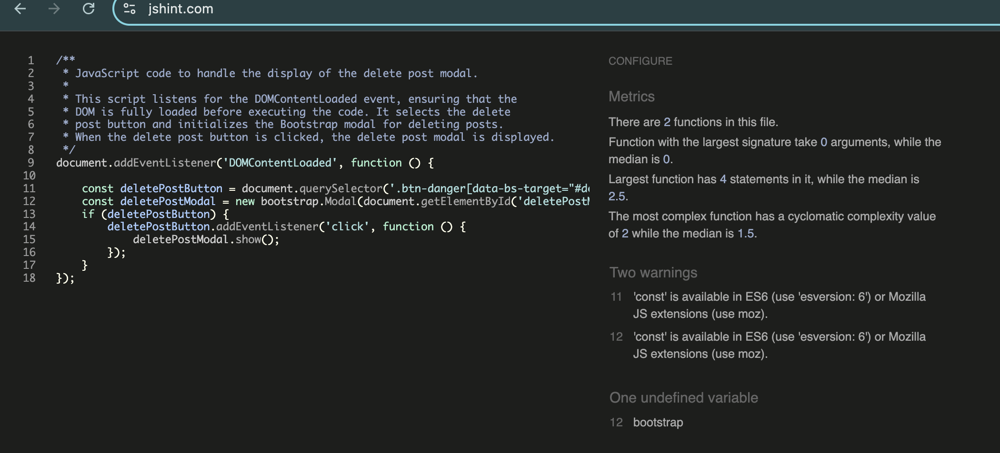

For both files, there are no errors to show, but purely some warnings about some of the syntax used only being available in ES6.

#### W3C HTML validator

I also used the W3C validator for testing the html of the site. Due to Django's templating language causing errors, I pasted in the HTMl from viewing the page source. 

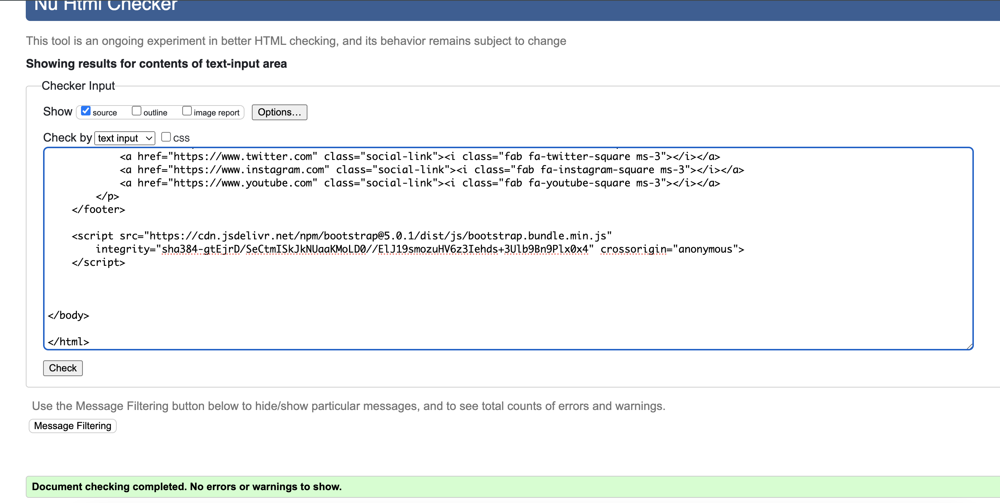
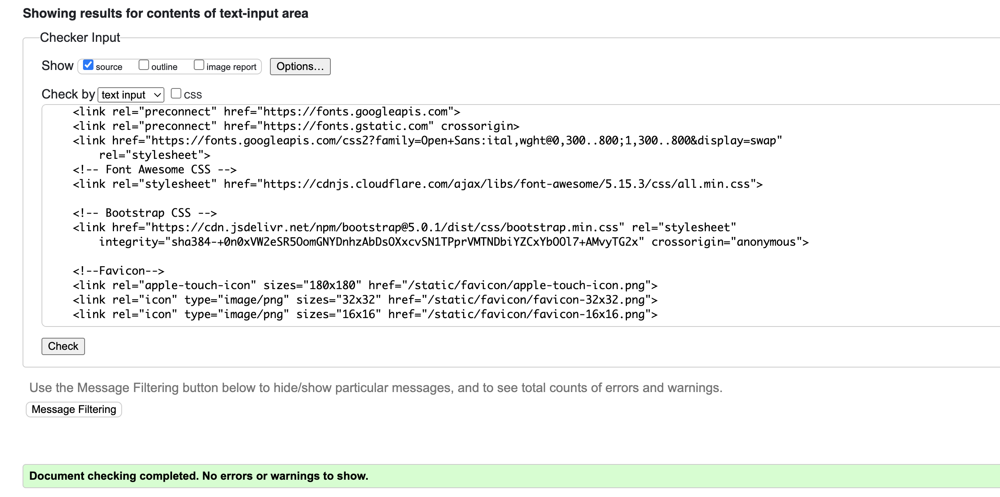
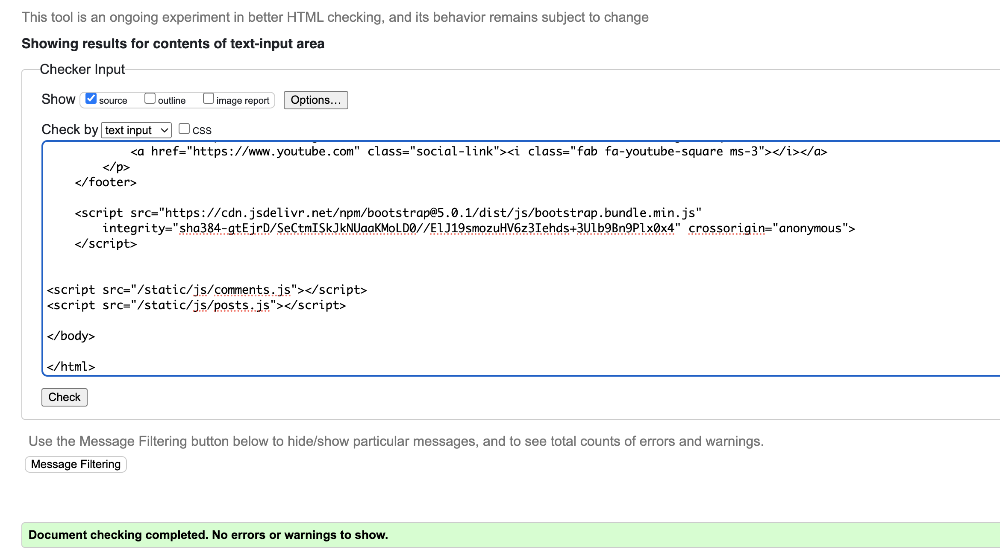

There are no errors to show within the W3C html validator on each page.

#### CSS Validator

To check for errors in the CSS, I used the W3C CSS validator, but thankfully, there are no errors to be seen.

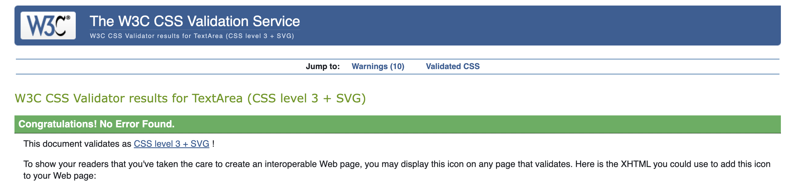

### Lighthouse Testing

In order to view the site's performance, I used Google Devtool's built in Lighthouse feature on each of the main pages to see how fast they respond. 

#### Home/Index Page

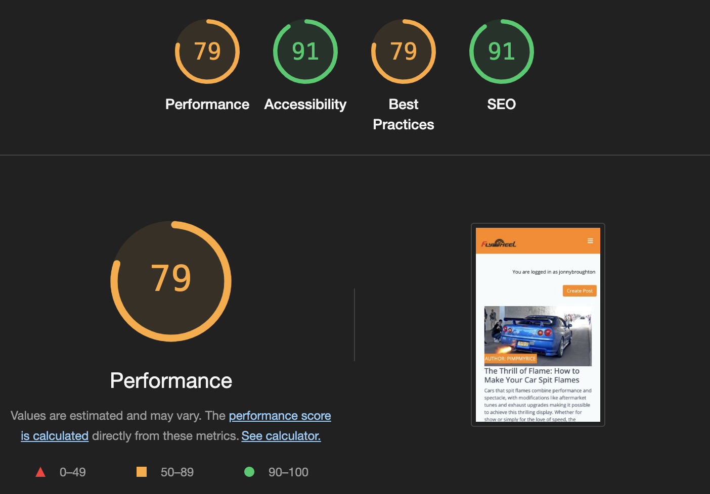
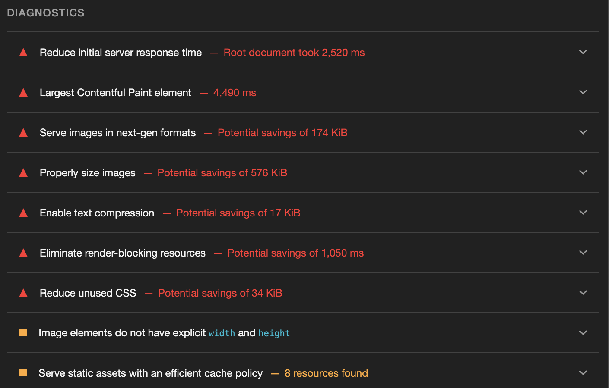

Looking at the lighthouse results for the home/index page, the site is very accessible, and is likely to appear well in search results, however the speed of the response from the website is slightly lacking, with images being a significant factor in this. If I were to make the site again, my goal would be to increase the performance of the site and reoptimise how the site handles images to make the response quicker.

#### Post Detail Page

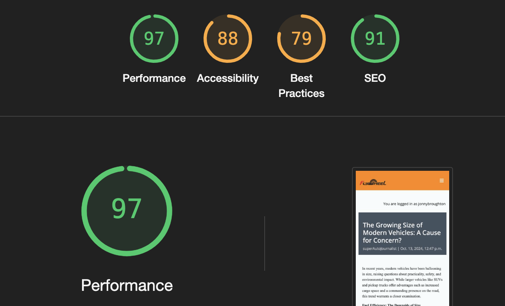
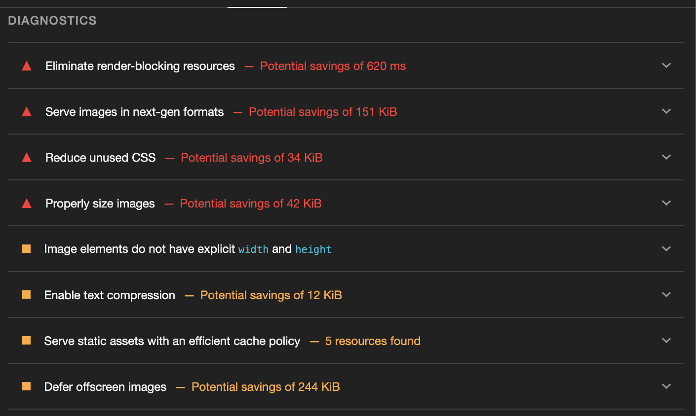

The post detail page performs significantly better than the index page, and, as we can see in the diagnostics report, this is likely down to there being only one image on this page at one time, along with some unused css. If I were to make the site again, I would ensure that there is no unused CSS and make sure images are being handled in a way they don't slow the site down as much.

#### Profile Page

For some reason, lighthouse testing does not go smoothly for the profile page. I am yet to find out what is causing the performance to not be able to be registered. If I created this website again, or had more time to understand this issue, I would make sure to solve what is affecting this test, but as far as it goes for the user, the site loads as normal.

### Deployment

The steps I used to deploy my project are as follows:

1. Ready code for deployment by changing debug to False, git commit and push
2. Sign in to heroku
3. Create a new app
4. Choose a unique name for your app and select your region (e.g., United States or Europe)
5. Connect your GitHub account to Heroku and select the repository you want to deploy
6. Under the Settings tab, scroll down to Config Vars. Here, you can add important environment variables like SECRET_KEY, DATABASE_URL, etc. Click Reveal Config Vars and enter your key-value pairs.
7. If you're not using automatic deploys, scroll down to the Manual Deploy section
8. Choose the branch to deploy from (e.g., main) and click Deploy Branch
9. Once deployment has finished open the app

### Credits

When beginning this project, I was slightly overwhelmed by just how much content there is to absorb, that I didn't feel confident starting the entire site from scratch, and so to get myself started, I followed the beginning of the django tutorial to help myself remember the processes and to allow for myself to expand on the functionality as I went along and got more confident. I followed the tutorial up until making the post detail and adding cloudinary images to posts. 

Evidence of content I borrowed to help me start is visible in:
- The post model
- The comment model
- posts.js
- comments.js
- Admin for posts and comments
- index.html
- post_detail.html

### Images

All posts with images are uploaded by users, but the default image is from https://scene7.toyota.eu/is/image/toyotaeurope/TOY_TGR21_HUB_GR86_ATT_IMG_KV_Dynamic:Medium-Landscape?ts=1645546718473&resMode=sharp2&op_usm=1.75,0.3,2,0

And the default profile image is from https://t4.ftcdn.net/jpg/02/15/84/43/360_F_215844325_ttX9YiIIyeaR7Ne6EaLLjMAmy4GvPC69.jpg